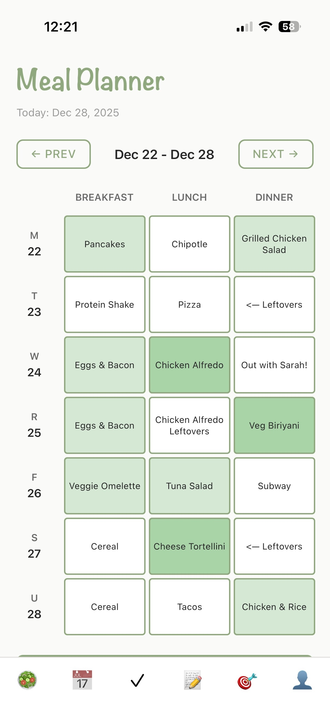
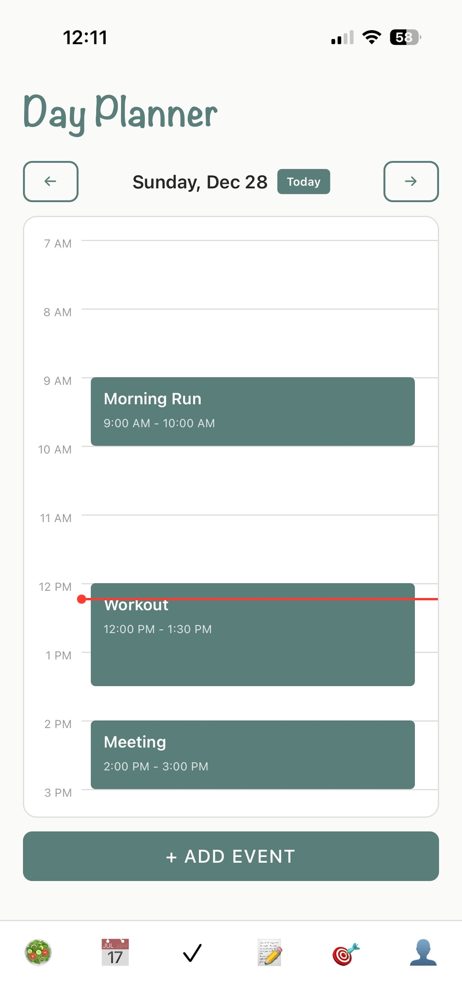
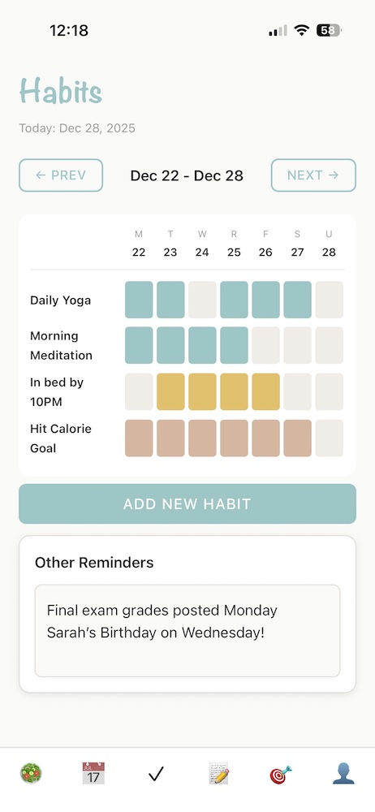
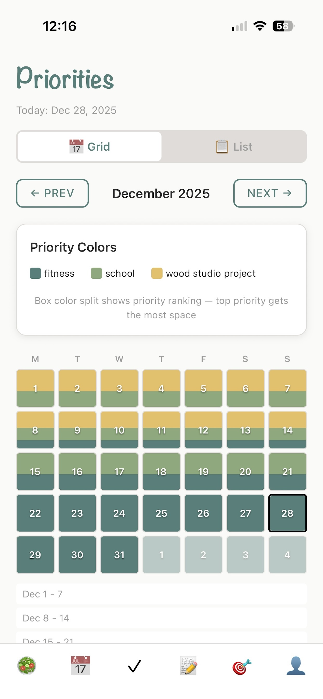

# Eudaimonia! 🌱

A calm, modular personal lifestyle tracker built with Expo and React Native. I made this app during my gap semester to help me maintain certain lifestyle aspects I had built at home but not at school, and put it up on the App Store after my family asked about using it as well.

This app is also 100% AI-made, largely due to the fact that my prior experience with React Native gave me enough understanding to let AI handle most things without getting tripped up in the occasional errors. I like to come back to this app when new tools come out (like Google's Antigravity recently) to keep up with AI-aided development.

Check it out on the App Store!

## Modules

- 🥗 **Food Planner** - Meal planning, grocery lists, and food logging

  

- 📅 **Day Planner** - Schedule your day with time blocks and recurring events
  

  

- ✓ **Habits** - Daily habit tracking with weekly grids and visualization
  

  

- 📝 **Notes** - Rich text notes with Apple Notes-inspired design
- 🎯 **Priorities** - Weekly priority tracking and visualization
  

  

- 💰 **Finances** - Track spending, manage expenses by category, view spending breakdowns with charts, and manage recurring subscriptions
